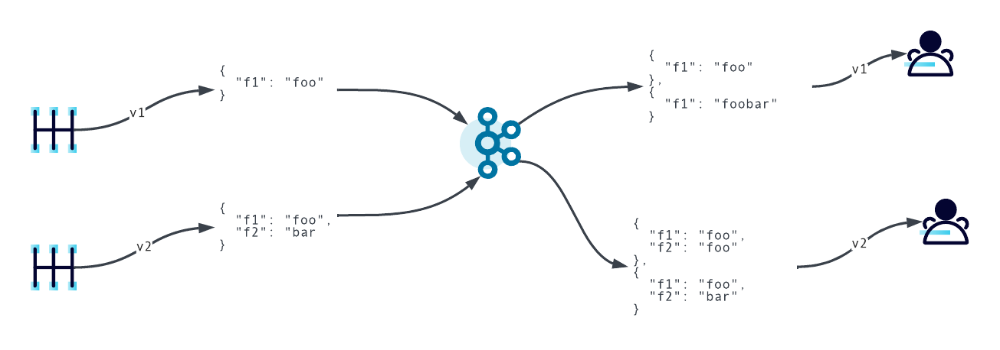

# Migration Rules

## Workflow 

The purpose of this example is to show both upgrade and downgrade migrations. 

When consumers using schema v2 is reading a message produced by schema v1 it will perform an upgrade and it will duplicate the content for f1 in f2.

When consumers using schema v1 is reading a message produced by schema v2 it will perform a downgrade and it will put f1 and f2 content in f1.

```
"ruleSet": {
		"migrationRules": [
			{
				"name": "upgrade",
				"kind": "TRANSFORM",
				"mode": "UPGRADE",
				"type": "JSONATA",
				"expr": "$merge([$sift($, function($v, $k) {$k = \"f1\"}), {\"f2\": $.f1}])",
				"disabled": false
			},
			{
				"name": "downgrade",
				"kind": "TRANSFORM",
				"mode": "DOWNGRADE",
				"type": "JSONATA",
				"expr": "$merge([$sift($, function($v, $k) {$k = \"f1\"}), {\"f1\": $join([$.f1, $.f2])}])",
				"disabled": false
			}
		]
	}
```



Use Confluent Cloud to run the following commands.  

### Variables 

```
BOOTSTRAP_SERVER=
SR_URL=
SR_API_KEY=
SR_API_SECRET=
```

### Confluent Cloud client properties

Replace API_KEY and API_SECRET in the following configuration and create a file named `client.properties`.

```
security.protocol=SASL_SSL
sasl.jaas.config=org.apache.kafka.common.security.plain.PlainLoginModule required username='API_KEY' password='API_SECRET';
sasl.mechanism=PLAIN
```

### Create topic

```
kafka-topics --bootstrap-server $BOOTSTRAP_SERVER --command-config client.properties --create --topic mig-demo --partitions 1
```

### Step 1 - Produce with schema v1

```
echo '{"f1": "foo"}' | kafka-avro-console-producer \
    --topic mig-demo \
    --broker-list ${BOOTSTRAP_SERVER} \
    --producer.config client.properties \
    --property schema.registry.url=${SR_URL} \
    --property basic.auth.credentials.source=USER_INFO \
    --property basic.auth.user.info=${SR_API_KEY}:${SR_API_SECRET} \
    --property value.schema='{"type":"record","name":"example","fields":
  [{"name":"f1","type":"string"}]}' \
    --property value.metadata='{"properties":{"application.version": "v1"}}' 
```

### Step 2 - Produce with schema v2

```
echo '{"f1": "foo", "f2": "bar"}' | kafka-avro-console-producer \
    --topic mig-demo \
    --broker-list ${BOOTSTRAP_SERVER} \
    --producer.config client.properties \
    --property schema.registry.url=${SR_URL} \
    --property basic.auth.credentials.source=USER_INFO \
    --property basic.auth.user.info=${SR_API_KEY}:${SR_API_SECRET} \
    --property value.schema='{"type":"record","name":"example","fields":
  [{"name":"f1","type":"string"}, {"name":"f2","type":"string", "default": "none"}]}' \
    --property value.rule.set='{ "migrationRules":
  [{ "name": "upgrade", "kind": "TRANSFORM", "type": "JSONATA",
     "mode": "UPGRADE", "expr": "$merge([$sift($, function($v, $k) {$k = \"f1\"}), {\"f2\": $.f1}])"},{ "name": "downgrade", "kind": "TRANSFORM", "type": "JSONATA",
     "mode": "DOWNGRADE", "expr": "$merge([$sift($, function($v, $k) {$k = \"f1\"}), {\"f1\": $join([$.f1, $.f2])}])"}]}' \
    --property value.metadata='{"properties":{"application.version": "v2"}}'
```

With the above `upgrade` rule, if a consumer with the schema v2 is reading something produced with schema v1 a "f2" field will be created with the same values as f1.

### Step 3 - Consume with schema v2 - Upgrade first message

```
kafka-avro-console-consumer \
    --from-beginning \
    --max-messages 2 \
    --topic mig-demo \
    --consumer.config client.properties \
    --bootstrap-server ${BOOTSTRAP_SERVER} \
    --property schema.registry.url=${SR_URL} \
    --property basic.auth.credentials.source=USER_INFO \
    --property basic.auth.user.info=${SR_API_KEY}:${SR_API_SECRET} \
    --property use.latest.version=true \
    --property rule.executors=upgrade \
    --property rule.executors.upgrade.class=io.confluent.kafka.schemaregistry.rules.jsonata.JsonataExecutor
```

### Step 4 - Consume with schema v1 - Downgrade second message

```
kafka-avro-console-consumer \
    --from-beginning \
    --max-messages 2 \
    --topic mig-demo \
    --consumer.config client.properties \
    --bootstrap-server ${BOOTSTRAP_SERVER} \
    --property schema.registry.url=${SR_URL} \
    --property basic.auth.credentials.source=USER_INFO \
    --property basic.auth.user.info=${SR_API_KEY}:${SR_API_SECRET} \
    --property print.schema.ids=true \
    --property use.latest.with.metadata=application.version=v1 \
    --property latest.cache.ttl.sec=300 \
    --property rule.executors=downgrade \
    --property rule.executors.downgrade.class=io.confluent.kafka.schemaregistry.rules.jsonata.JsonataExecutor
```

### Cleanup 

```
kafka-topics --bootstrap-server $BOOTSTRAP_SERVER --command-config client.properties --delete --topic mig-demo
curl --request DELETE -u $SR_API_KEY:$SR_API_SECRET \
  --url "$SR_URL/subjects/mig-demo-value"
curl --request DELETE -u $SR_API_KEY:$SR_API_SECRET \
  --url "$SR_URL/subjects/mig-demo-value?permanent=true"
```
